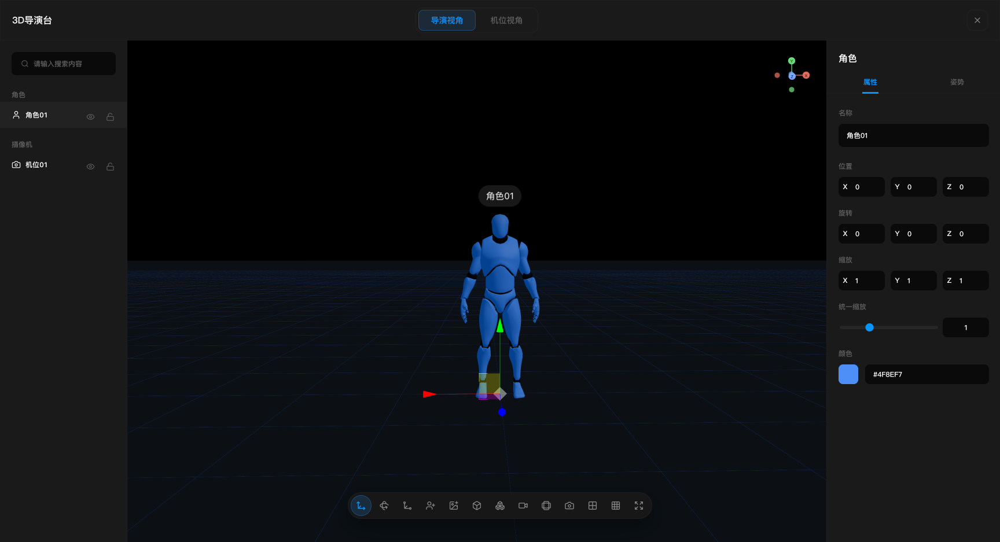
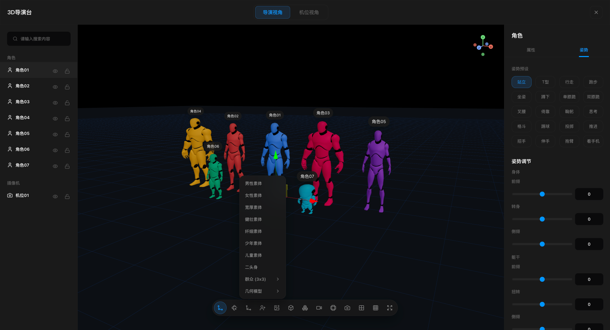
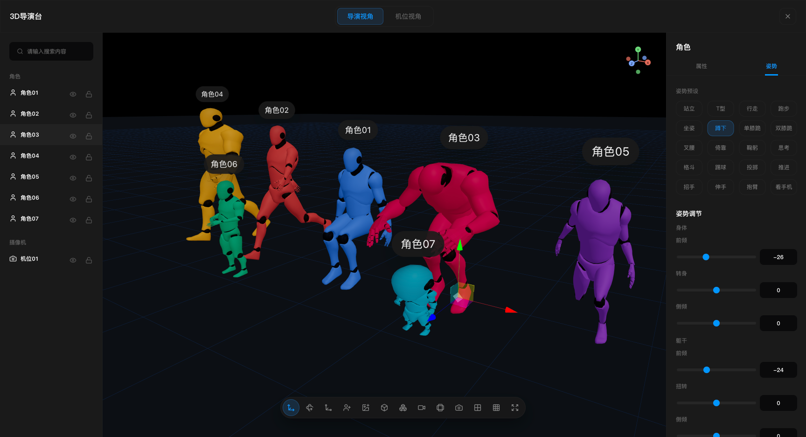
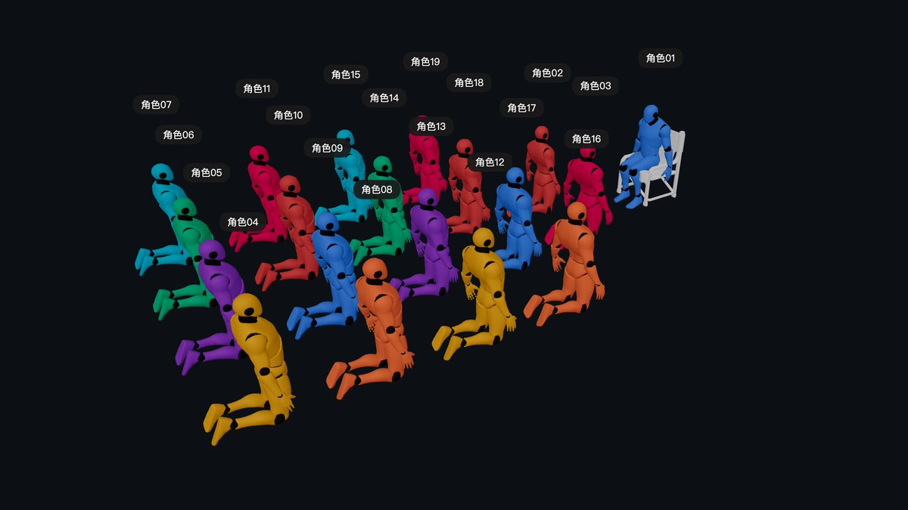

# 3D导演台

一个基于 React、Vite、Three.js 和 React Three Fiber 的 3D 分镜导演台。它适用于轻量级预演、镜头规划和场景摆位，支持在浏览器里搭建角色、机位、场景和全景背景，并快速记录镜头与截图结果。
<div align="center">
注册一键对接
【aiyiwei.vip】开发者和生图AI爱好者调用中转：100ms响应，1元开票，30+工具零改造。生图使用codex专属分组，gpt img2.0每张2分钱平均
<p>claude code推荐特价 Claude Code分组。 gpt推荐codex专属分组和纯az分组。gemini使用gemini-cli分组 新增claude code4.7</p>
<p>限时特价分组，1毛到2毛每百万token gpt-5-nano-2025-08-07 专属养虾</p>
<p>看过来 👉https://aiyiwei.vip/register?aff=9RDC（尾部带个人邀请码，介意可删除尾部字母）</p>
<p>-官网 1-2折，534个全球模型统一管控。</p>
<p>-0.5元到0.7元人民币每刀</p>
<p>-最低1元起充，按需使用无现金流压力</p>
<p>-💼 财务合规无忧</p>
<p>-每笔充值均可开电子发票，最低 1元 起开</p>
<p>-注册就送 $0.2，每天签到领 $0.2-$1</p>
<p>-告别代充灰色渠道，审计直接过	</p>
<p>-🛠️ 30+企业工具一键接入，现有系统零改造</p>
<p>-Claude Code/Cline/Cursor企业部署 → 文档已备</p>
<p>常用龙虾文档:https://vuc9cuve6c.apifox.cn/doc-8779250</p>
<p>-Claude Code → https://vuc9cuve6c.apifox.cn/doc-8779254</p>
<p>-Codex→ https://vuc9cuve6c.apifox.cn/doc-8779249</p>
<p>-Cline → https://vuc9cuve6c.apifox.cn/doc-8779261</p>
<p>-等30多个代码和开发工具适配文档已备齐</p>
<p>-一个接口自动适配，标准OpenAI格式，现有代码改个base_url直接跑，1小时完成接入</p>
<p>-5分钟配通工具，满意再规模化——让AI基础设施像水电一样即开即用</p>
<p>-推广有邀请奖励：推广奖励支持支付宝提现</p>

</div>
## 功能概览

- 导演视角 / 机位视角切换
- 内置8种不同的人物，20种不同的人物姿势
- 角色、群演、基础几何体和机位快速添加
- 本地 FBX / OBJ 模型导入，可自定义模型库
- 群众阵列，想多少人就可以多少人
- 全景图导入与背景调节
- 机位拍摄、截图记录和基础镜头管理
- 视口比例框、九宫格、平移 / 旋转 / 缩放控制
- 本地场景状态持久化

## 界面截图








## 技术栈

- React 18
- Vite 6
- TypeScript
- Three.js
- @react-three/fiber
- @react-three/drei
- Zustand
- Vitest

## 项目结构

```text
src
├─ app/layout          # 顶层壳布局，组织画布与左右侧栏
├─ editor/canvas       # Three.js / R3F 视口、画幅框、工具条、截图视图
├─ editor/panels       # 左侧对象树与右侧属性面板
├─ editor/store        # Zustand 状态管理、撤销与剪贴板逻辑
├─ editor/io           # 截图导出、工程导入导出、宿主通信
├─ editor/loaders      # 本地模型与全景图导入
├─ editor/runtime      # 角色渲染、骨骼和姿势应用
├─ editor/schema       # 数据结构、机位和视口相关定义
└─ styles              # 全局样式
```

## 本地开发

```bash
npm install
npm run dev
```

默认开发地址通常为：

```text
http://127.0.0.1:5173/
```

如果本机端口被占用，Vite 会自动顺延到下一个可用端口。

预览生产包：

```bash
npm run preview
```

默认预览地址通常为：

```text
http://127.0.0.1:4173/
```

## 常用操作

- 顶部可切换 `导演视角` 与 `机位视角`
- 左侧用于搜索、选择、分组查看场景对象，并支持可见性 / 锁定 / 删除
- 中央视口用于摆放场景、切换变换模式、添加角色和机位、导入资源与截图
- 右侧属性面板会根据当前选中对象自动切换为场景 / 角色 / 模型 / 摄像机编辑面板

## 快捷键

- `Ctrl/Cmd + C`：复制当前选中对象
- `Ctrl/Cmd + V`：粘贴复制对象
- `Ctrl/Cmd + Z`：撤销最近一次操作
- `Delete / Backspace`：删除当前选中对象

## 数据与嵌入

- 当前场景与本地模型库会写入浏览器 `localStorage`
- 支持导出工程 JSON，也支持通过文件重新导入
- 支持“保存最近工程 / 恢复最近工程”
- 组件已包含宿主页面通信桥，适合嵌入到更大的创作工作台中

## 构建与测试

构建：

```bash
npm run build
```

测试：

```bash
npm test
```

最近一次核对结果：

- `npm run build` 可通过
- 构建阶段会出现少量 Vite 警告：部分模型库缩略图 URL 会保留到运行时解析，同时主包体积超过默认 chunk 警告阈值
- `npm test` 当前为 `304 / 312` 用例通过，剩余 `8` 个失败用例主要集中在模型库面板、视口画幅/轴向命中区、个别姿势预设和样式断言

## 开源说明

- 本仓库以源码演示为主，适合继续扩展为更完整的 3D 导演工具。
- 当前版本保留内置角色能力，并支持通过界面导入本地模型与全景图。
- 若你基于本项目继续发布，请自行确认新增模型、贴图和场景素材的分发许可。

## License

MIT
